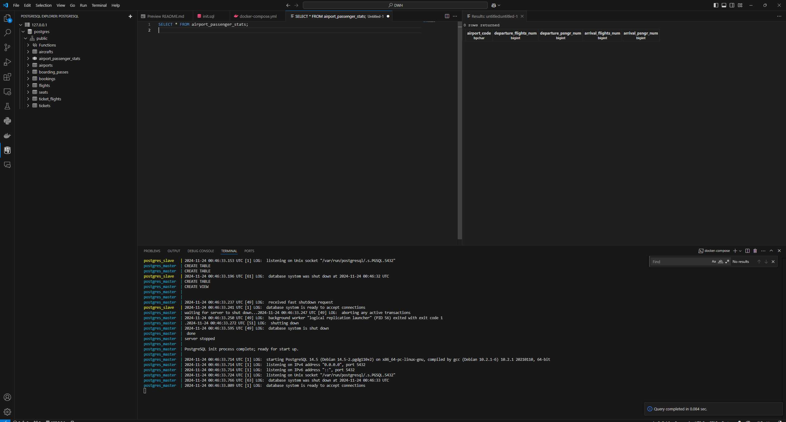

## Авторы
1. **Имайкин Егор Евгеньевич**, [im_egorrrr](https://t.me/im_egorrrr)
2. **Лебедев Никита Александрович**, [nikit_lebedev](https://t.me/nikit_lebedev)
3. **Труфанов Дмитрий Михайлович**, [dimi3_tru](https://t.me/dimi3_tru)
4. **Смирнов Арсений Сергеевич**, [ars_kko](https://t.me/ars_kko)

Группа мФТиАД231

## Описание
Проект нацелен на создание и настройку системы репликации PostgreSQL с мастер-слейв архитектурой. 

Что мы сделали:
1. Подняли инстанс PostgreSQL с помощью `docker-compose`.
2. Инициализировали базы данных из SQL-скрипта (`init.sql`), содержащего:
   - Создание таблиц;
   - Создание представления (`VIEW`) для подсчёта пассажиропотока (это наше бонусное задание).
3. Настроили репликации между мастер- и слейв-узлами.
4. Попробовали запустить SQL-запрос для проверки функциональности (вьюшки). Ниже пример того, что получилось, данных внутри нет.


## Как запустить проект

Клонирование проекта из этого репо:
```
git clone https://github.com/DOMENTOR/DWH_hw01
cd hw01
```
Запуск инициализации БД:
```
docker-compose up --build
```
Параметры для подключения:
Мастер
```
psql -h 127.0.0.1 -p 5432 -U postgres -d postgres
```
Слейв:
```
psql -h 127.0.0.1 -p 5433 -U postgres -d postgres
```
Использование View (бонусное):
```sql
SELECT * FROM airport_passenger_stats;
```

## Краткое описание файлов:

- **`docker-compose.yml`** — конфигурация Docker для развёртывания системы.
- **`init.sql`** — SQL-скрипт для создания структуры базы данных и вьюшки.
- **`init-script`** — скрипты для настройки репликации.
  - `init-slave.sh` — настройка слейва для подключения к мастеру.
  - `create-replica-user.sh` — создание пользователя репликации.
  - `backup-master.sh` — скрипт для резервного копирования данных мастера.
- **`data/` и `data-slave/`** — директории для хранения данных мастера и слейва (создаются автоматически).

